# Tecnicatura Superior en Desarrollo de Software
## **1° Entrega de Proyecto Parcial<br>API RESTful CRUD <br>Caso 2: ClickWave**

**Materia:** Desarrollo de Sistemas Web (Back End)  
**Profesor:** Emir Eliezer Garcia Ontiveros  
**Comisión:** A  

**Grupo 2:**  
- Mendiola, Eduardo E.  
- Moreno, Miriam
- Integrante 3  
- Integrante 4  
- Integrante 5  

**Fecha:** 17-09-2025  

---
**Para ejecutarlo:**
1. Clonar el repositorio
2. Instalar dependencias con `npm install`
3. Crear archivo `.env` con tus variables
4. Ejecutar con `npm run dev` o `npm start`
---

## Índice

1. [Introducción del Caso](#introducción-del-caso)  
   1.1 [Propósito del Sistema](#11-propósito-del-sistema)  
   1.2 [Contexto Empresarial](#12-contexto-empresarial)  
      - 1.2.1 [Descripción General de ClickWave](#121-descripción-general-de-clickwave)  
      - 1.2.2 [Problemáticas Detectadas](#122-problemáticas-detectadas)
            
   1.3 [Objetivos del Sistema](#13-objetivos-del-sistema)  
   1.4 [Arquitectura Técnica del Sistema](#14-arquitectura-técnica-del-sistema)  
2. [Asignación de Roles y Responsabilidades](#2-asignación-de-roles-y-responsabilidades)  
   - [Eduardo E. Mendiola](#eduardo-e-mendiola)  
     - Rol Asignado: Arquitectura de Software y Desarrollo  
   - [Miriam Moreno](#miriam-moreno)
     - Rol Asignado: Backend Developer
3. [Funcionamiento del Sistema](#3-funcionamiento-del-sistema)  
   3.1 [Funcionamiento General](#31-funcionamiento-general)  
   3.2 [Funcionalidades y Módulos Principales](#32-funcionalidades-y-módulos-principales)  
   3.3 [Interacción entre Módulos](#33-interacción-entre-módulos)  
   3.4 [Modelo de Datos y Entidades del Sistema](#34-modelo-de-datos-y-entidades-del-sistema)
   - 3.4.1 [Entidades y su contexto](#341-entidades-y-su-contexto)
   - 3.4.2 [Diagrama DER](#342-diagrama-der)
4. [Cómo ejecutar este proyecto](#4-cómo-ejecutar-este-proyecto)  
   4.1 [Clonar el repositorio:](#41-clonar-el-repositorio)  
   4.2 [Instalar las dependencias](#42-instalar-las-dependencias)      
   4.3 [Ejecutar la aplicación](#43-ejecutar-la-aplicación)   
   4.4 [Abrir la aplicación en el navegador](#44-abrir-la-aplicación-en-el-navegador)   
   4.5 [Variables de entorno](#45-variables-de-entorno)   
5. [Capturas de Consultas](#5-capturas-de-consultas)  
   5.1 [Ejecución del Servidor](#51-ejecución-del-servidor)  
   5.2 [Ejemplo de Consulta - CRUD: Cliente](#52-ejemplo-de-consulta---crud-cliente)  
   5.3 [Ejemplo de Consulta - CRUD: Projecto](#53-ejemplo-de-consulta---crud-projecto)
6. [Uso de IAs](#6-uso-de-ias)  
   6.1 [Modelos](#61-modelos)  
   6.2 [Prompts](#62-prompts)  
7. [Bibliografía y Fuentes](#7-bibliografía-y-fuentes)

---

<br/>


## Introducción del Caso

### 1.1 Propósito del Sistema
El presente documento describe el Sistema de Gestión de Proyectos desarrollado para ClickWave, una consultora de marketing digital, con el objetivo de optimizar la gestión interna de proyectos y mejorar la eficiencia operativa. La propuesta tecnológica busca transformar procesos informales en flujos de trabajo estandarizados, medibles y trazables, facilitando la centralización de información y la toma de decisiones basada en datos confiables.

### 1.2 Contexto Empresarial

#### 1.2.1 Descripción General de ClickWave
ClickWave fue fundada en 2020 con el propósito de brindar servicios de marketing digital a pequeñas y medianas empresas (PyMEs). Comenzó como un proyecto remoto de un equipo reducido y actualmente cuenta con 12 empleados organizados en distintas áreas: gestión de campañas publicitarias, diseño gráfico, análisis de datos y desarrollo de contenidos digitales.  
Su modalidad de trabajo es híbrida, combinando presencia en oficina y trabajo remoto, lo que permite atender clientes locales e internacionales, aunque mantiene desafíos internos asociados a la informalidad de procesos y la ausencia de roles claramente definidos.

#### 1.2.2 Problemáticas Detectadas
- **Falta de control formal de tiempos:** dificulta la justificación de costos y el cálculo de rentabilidad de los proyectos.  
- **Roles y responsabilidades poco definidos:** provoca desorganización, sobrecarga de trabajo y seguimiento ineficiente.  
- **Limitaciones en evaluación de desempeño y análisis financiero:** impide una evaluación objetiva del rendimiento y retrasa informes financieros precisos.

### 1.3 Objetivos del Sistema
- Formalizar la gestión de proyectos y tareas, centralizando la información y garantizando trazabilidad.  
- Registrar y controlar el tiempo dedicado a cada proyecto para analizar rentabilidad y justificar costos.  
- Generar reportes detallados y paneles de control gerenciales.  
- Integrar la gestión de proyectos con contabilidad y facturación, optimizando procesos financieros.

### 1.4 Arquitectura Técnica del Sistema
El sistema fue desarrollado con un stack **JavaScript**: Node.js como entorno de ejecución y Express.js como framework web. La arquitectura sigue el patrón **MVC** (Modelo-Vista-Controlador), permitiendo:
- Separación clara de responsabilidades entre presentación, lógica de negocio y acceso a datos.  
- Facilitar mantenibilidad, escalabilidad y comprensión del código.  
- Garantizar un flujo de información seguro y centralizado entre usuarios, proyectos y tareas.

---

## 2. Asignación de Roles y Responsabilidades

### **Eduardo E. Mendiola**  
**Rol:** Arquitectura de Software y Desarrollo  

**Responsabilidades y tareas:**

Las responsabilidades y las tareas realizadas en el proyecto abarcan todo el ciclo de vida del desarrollo, desde el diseño arquitectónico hasta la implementación de componentes.  

### Diseño y Definición de la Arquitectura del Sistema
- Establecimiento de una arquitectura modular y jerárquica para la aplicación, organizando el código en controladores, modelos, entidades y rutas, promoviendo la reutilización y el mantenimiento del código.

### Desarrollo del Core del Framework (Base Controllers y Models)
- **Implementación de BaseController:** Creación de la clase BaseController que encapsula las operaciones CRUD (Create, Read All, Read One by ID, Update, Patch, Delete) comunes para todas las entidades, gestionando las respuestas HTTP (status 201, 200, 404, 500, 204) y el manejo de errores centralizado.  
- **Implementación de BaseModel:** Creación de la BaseModel que proporciona una interfaz genérica para la interacción con la base de datos subyacente (JSON), incluyendo los métodos `create`, `findAll`, `findById`, `update`, `patch` y `delete`. Esta clase utiliza un generador de IDs y el objeto db configurado.

### Gestión de Persistencia de Datos (Base de Datos JSON)
- **Modelado de la Base de Datos:** Modelado de datos del sistema. Se identificaron las entidades principales (`users`, `roles`, `clients`, `projects`, `tasks`, `time_entries`, `estimates`, `invoices`, `payments`, `expenses`, `teams`, `team_members`, `documents`) y sus relaciones clave, asegurando que cada colección refleje correctamente la estructura del negocio y permitiera la trazabilidad de la información. 
- **Creacioón de diagramas:** Modelado de la base de datos del sistema mediante un **Diagrama de Entidad-Relación (DER)** en SQL, incluyendo todas las entidades, atributos y relaciones principales. Este diagrama sirvió para generar las tablas y claves foráneas en MySQL, definiendo la estructura relacional de la base de datos. Posteriormente, se planifica adaptar este modelo a **MongoDB**, utilizando referencias o documentos embebidos según convenga para la persistencia en formato JSON.
- **Creación de JsonDatabase:** Desarrollo de un sistema de base de datos basado en archivos JSON, `JsonDatabase.js`, que maneja la carga y guardado de datos de forma asíncrona en un archivo `db.json`. Este módulo también gestiona las colecciones dentro del archivo JSON.  
- **Configuración de la Base de Datos:** Configuración de la instancia de `JsonDatabase` para ser utilizada en toda la aplicación a través de `db.js`.  
- **Población de Datos Iniciales:** Creación y población del archivo `db.json` con datos de ejemplo para diversas colecciones como `users`, `areas`, `roles`, `clients`, `projects`, `tasks`, `time_entries`, `estimates`, `invoices`, `payments`, `expenses`, `teams`, `team_members` y `documents`, estableciendo una estructura de datos para la aplicación.  
- **Generación de IDs Únicos (IdGenerator):** Creación de la `IdGenerator` para generar IDs secuenciales y únicos para los nuevos elementos en cada colección de la base de datos.

### Implementación de Entidades Específicas del Dominio
- **Definición de Clases de Entidad:** Creación de las clases `ClientEntity`, `RoleEntity` y `UserEntity`, que modelan la estructura de datos y el comportamiento de los clientes, roles y usuarios, respectivamente, incluyendo métodos específicos como `getFullName()` o `getDisplayName()`.  
- **Desarrollo de Modelos Específicos:** Implementación de `ClientModel`, `RoleModel` y `UserModel`, extendiendo `BaseModel` y adaptando la lógica de creación de IDs y el manejo de timestamps (para usuarios).  
- **Desarrollo de Controladores Específicos:** Creación de `ClientController`, `RoleController` y `UserController`, extendiendo `BaseController` para manejar las operaciones específicas de cada entidad a través de la API.

### Configuración de Rutas de la API
- **Definición de Rutas Principales:** Configuración del archivo `app.js` para integrar las rutas de clientes, usuarios y roles en la API, definiendo los endpoints base `/api/client`, `/api/users` y `/api/roles`.  
- **Creación de Archivos de Rutas Específicos:** Implementación de `clientRoutes.js`, `userRoutes.js` y `roleRoutes.js` para definir los endpoints CRUD para cada entidad, mapeando las solicitudes HTTP a los métodos de los controladores correspondientes.  
- **Implementación de Middlewares:** Desarrollo de un middleware de validación, `validationMiddleware.js`, para asegurar la calidad de los datos de entrada, como `validateClientInput` para los clientes.

### Creación y Configuración del Servidor Principal (server.js)
- **Servidor Principal:** Creación del archivo `server.js`, el punto de arranque de la aplicación. Este archivo carga las variables de entorno, inicializa la base de datos y pone en marcha el servidor Express, escuchando las peticiones en un puerto específico.  
- **Configuración de Puertos y Variables de Entorno (.env):** Instalación de la dependencia `dotenv` desde npm para gestionar de manera centralizada la configuración de variables de entorno. A través del archivo `.env` se definió el puerto del servidor y queda disponible para futuras variables necesarias como por ejemplo, la conexión a MongoDB. Esto permite una configuración flexible y desacopla del código. El archivo `server.js` carga y utiliza estas variables mediante la dependencia `dotenv`, garantizando una mayor portabilidad y mantenibilidad de la aplicación.

### User Interface / Views:
- **Creación de Plantillas Pug y Lógica de Vistas:** Desarrollo de las vistas de la aplicación utilizando Pug como motor de plantillas, incluyendo la página de inicio (layout.pug e index.pug), plantillas de manejo de errores (error500.pug y error404.pug), y las vistas específicas para clientes (list.pug, details.pug) y para usuarios (list.pug y details.pug).  
- **Vistas entidades:**
clients (list.pug, details.pug),
users (list.pug, details.pug, form.pug, edit.pug).
- **Implementación de lógica** en los controladores para renderizar estas vistas con los datos provenientes de los modelos, manteniendo los métodos genéricos de BaseController y adaptándolos para permitir la renderización dinámica de cualquier entidad. Se aplicó Bootstrap con tema oscuro y estilos para botones, tablas y navegación.
- **Implementación** de lógica para **eliminar** y **actualizar**.

### Actualizaciones y refactorización de código: 
- **Refactorización completa del proyecto** para utilizar `ECMAScript Modules (ESM)`, reemplazando require y module.exports por import y export. Se actualizaron todos los modelos, controladores, entidades y rutas. 
- **Se implementó fieldsOrder en BaseModel** y en los modelos de User, Client y Role para asegurar un orden consistente de propiedades en las respuestas JSON en operaciones de create, update y patch. Se mantuvo toda la lógica existente y se aplicaron buenas prácticas de legibilidad y mantenimiento de código.

### Owner y Maintainer del repositorio GitHub: 
- **Creación del Repositorio en GitHub:** Gestión de la inicialización y configuración del repositorio de control de versiones en GitHub para el proyecto, facilitando la colaboración y el seguimiento de los cambios. 
- **Responsable del mantenimiento del repositorio en GitHub**, me encargué de administrar las **pull requests** enviadas por los colaboradores. 
- **Revisar el código propuesto**, verificar que cumpliera con los estándares del proyecto, dar retroalimentación cuando fue necesario
- **Aprobar o rechazar cambios** y finalmente **integrarlos** al repositorio principal.

### Control de Versiones y Documentación
- **Creación del Repositorio en GitHub:** Gestión de la inicialización y configuración del repositorio de control de versiones en GitHub para el proyecto, facilitando la colaboración y el seguimiento de los cambios.  
- **Capturas de consultas:** capturas de pantalla de las peticiones realizadas con la herramienta Postman en Visual Studio Code, a la API RESTful para demostrar su funcionamiento y validar las operaciones CRUD.
- **Capturas de pantallas:** capturas de pantalla realizadas con plantillas pug y bootstrap.
- **Generación de la documentación:** Elaboración de un documento en Google Docs como base principal de la documentación del proyecto, adaptado a los requisitos de entrega del trabajo práctico y posteriormente exportado en formato PDF. Este documento incluye la asignación de roles, las fuentes consultadas y el enlace al video explicativo del proyecto.  
- **Creación del archivo README:** Adaptación del contenido del documento principal al archivo `README.md`, que funcionará como documentación de referencia dentro del repositorio. Este archivo resume la información esencial sobre el funcionamiento, instalación y uso de la aplicación.


---
### **Miriam Moreno**  

# Implementación de Entidad **Project**

## Definición de Clase de Entidad
Creación de la clase **`ProjectEntity`**, que modela la estructura 
de datos y el comportamiento de los proyectos, incluyendo 
propiedades como:  

- `client_id`  
- `name`  
- `description`  
- `start_date`  
- `end_date`  
- `budget`  
- `billing_type`  
- `status`  
- `manager_id`  

---

## Desarrollo de Modelo Específico
Implementación de **`ProjectModel`**, extendiendo **`BaseModel`** 
y adaptando la lógica para:  

- Gestión de **IDs**.  
- Manejo de atributos propios de la entidad **Project**.  

---

## Desarrollo de Controlador Específico
Creación de **`ProjectController`**, extendiendo 
**`BaseController`** para manejar las operaciones **CRUD** de los 
proyectos a través de la API:  

- **POST**  
- **GET**  
- **PUT**  
- **PATCH**  
- **DELETE**  


## 3. Funcionamiento del Sistema

La aplicación es una API RESTful construida sobre Express.js que permite gestionar un sistema de proyectos, clientes y tiempo. Su diseño modular facilita la escalabilidad y el mantenimiento.

### 3.1. Funcionamiento General
El sistema opera como un servidor web que escucha peticiones HTTP. Cuando recibe una petición, la procesa a través de una serie de capas (rutas, middlewares, controladores, modelos) hasta interactuar con una base de datos JSON para almacenar y recuperar información. Las respuestas se envían en formato JSON.  

El punto de entrada de la aplicación es **server.js**. Este archivo es responsable de:
- Cargar las variables de entorno del archivo `.env` utilizando la librería `dotenv`.  
  Por ejemplo, define el puerto en el que el servidor escuchará las peticiones, como `PORT = 4000`.
- Inicializar la base de datos (`db.initialize()`) antes de arrancar el servidor.
- Importar la instancia de la aplicación Express (`app.js`) y ponerla a escuchar en el puerto configurado, mostrando un mensaje en la consola:  
  `Servidor de ClickWave corriendo en http://localhost:${PORT}`

### 3.2. Funcionalidades y Módulos Principales

#### Servidor Principal (server.js)
- Es el punto de arranque de la aplicación.  
- Carga la configuración del entorno desde `.env` usando `dotenv`.  
- Inicializa la base de datos JSON antes de que la aplicación comience a recibir solicitudes.  
- Inicia la instancia de la aplicación Express (`app`) y la hace escuchar en el puerto especificado (por defecto 4000 si se carga desde `.env.txt`).  

#### Variables de Entorno (.env) y dotenv
- El archivo `.env` almacena variables de configuración que son sensibles o que pueden cambiar entre diferentes entornos (desarrollo, producción), como el número de `PORT` y accesos a bases de datos como MongoDB.  
- La librería `dotenv` se utiliza en `server.js` para cargar estas variables en `process.env`, haciéndolas accesibles en toda la aplicación. Esto permite una configuración flexible sin codificar valores directamente en el código fuente.  

#### Servidor Express (app.js)
- Es la aplicación principal de Express, importada por `server.js`.  
- Configura middlewares globales, como `express.json()`, para parsear cuerpos de solicitud JSON.  
- Monta las rutas específicas de cada entidad (clientes, usuarios, roles, Projectos) bajo sus respectivos prefijos (`/api/clientRoutes`, `/api/users`, `/api/roles`).  
- Define una ruta de bienvenida y un manejador de errores 404 para rutas no encontradas.  

#### Base de Datos JSON (JsonDatabase.js, db.js)
- `JsonDatabase.js` gestiona la persistencia de datos. Carga y guarda la información en un archivo `db.json`.  
- Proporciona métodos para `getCollection(name)` y `setCollection(name, data)` para interactuar con las diferentes colecciones (e.g., "users", "clients") dentro del archivo JSON.  
- `db.js` es la instancia centralizada de `JsonDatabase` utilizada por los modelos.  

#### Generador de IDs (IdGenerator.js)
- Se encarga de crear IDs secuenciales únicos para cada nueva entrada en una colección específica, basándose en el último ID existente en esa colección.  

#### Entidades (Entity.js)
- Definen la estructura y los atributos de los objetos de negocio (e.g., `ClientEntity`, `RoleEntity`, `UserEntity`, `ProjectEntity`).  
- Pueden incluir métodos específicos de negocio (e.g., `getFullName()` en `ClientEntity` y `UserEntity`, `getDisplayName()` en `RoleEntity`).  

#### Modelos (Model.js, BaseModel.js)
- **BaseModel.js:** Proporciona las operaciones CRUD genéricas que interactúan directamente con `JsonDatabase`. Incluye métodos para `create`, `findAll`, `findById`, `update`, `patch` y `delete`. Utiliza el `IdGenerator` para la asignación de IDs.  
- **Modelos Específicos (e.g., ClientModel.js, RoleModel.js, UserModel.js):** Extienden `BaseModel` para gestionar datos de una entidad particular. Pueden sobrescribir o añadir lógica específica, como la inyección de IDs generados o la actualización de timestamps en los métodos `create` y `update`.  

#### Controladores (Controller.js, BaseController.js)
- **BaseController.js:** Contiene la lógica para manejar las peticiones HTTP y las respuestas, envolviendo las operaciones CRUD del `BaseModel` con manejo de errores y códigos de estado HTTP apropiados.  
- **Controladores Específicos (e.g., ClientController.js, RoleController.js, UserController.js):** Extienden `BaseController` para exponer las operaciones CRUD para cada entidad a través de la API.  

#### Rutas (Routes.js)
- Definen los endpoints de la API y asocian las peticiones HTTP (`POST`, `GET`, `PUT`, `PATCH`, `DELETE`) con los métodos correspondientes en los controladores.  
- Pueden integrar middlewares de validación antes de que la petición llegue al controlador, como `validateClientInput` en `clientRoutes.js`.  

#### Middlewares (validationMiddleware.js)
- Contienen funciones que se ejecutan antes de los controladores para realizar validaciones sobre los datos de entrada de las peticiones.  
- Por ejemplo, `validateClientInput` verifica la presencia de campos obligatorios para un cliente.  

### 3.3. Interacción entre Módulos
- El archivo `server.js` arranca el servidor Express y asegura que la base de datos esté inicializada y las variables de entorno cargadas.  
- Una petición HTTP (e.g., `POST /api/clients`) llega al servidor Express configurado en `app.js` (que es iniciado por `server.js`).  
- `app.js` dirige la petición a la ruta correspondiente (e.g., `clientRoutes.js`).  
- La ruta puede aplicar un middleware de validación (e.g., `validateClientInput`) para verificar los datos de la petición.  
- Si la validación es exitosa, la petición se pasa al método del controlador (e.g., `clientController.create`) asociado a esa ruta y verbo HTTP.  
- El método del controlador (que extiende `BaseController`) invoca la operación correspondiente en su modelo asociado (e.g., `ClientModel.create`).  
- El modelo (que extiende `BaseModel`) utiliza la instancia de `JsonDatabase` (`db`) para interactuar con el archivo `db.json`, realizando la operación de lectura o escritura de datos. Si es una operación de creación, el `IdGenerator` se utiliza para asignar un ID único.  
- El resultado de la operación se devuelve desde el modelo al controlador.  
- Finalmente, el controlador construye una respuesta HTTP (con un código de estado y datos en formato JSON) y la envía de vuelta al cliente.  

### 3.4. Modelo de Datos y Entidades del Sistema

El sistema ha sido diseñado como una API RESTful que gestiona proyectos, clientes y tiempo, cumpliendo directamente con las necesidades de ClickWave de implementar un “Sistema de Gestión de Proyectos y Tiempo”. La arquitectura del sistema se basa en un enfoque modular, y la persistencia de datos se realiza mediante JsonDatabase en un documento JSON.

#### 3.4.1. Entidades y su contexto:

1. **users (Usuarios)**  
   **Descripción de la Entidad:** Esta colección almacena información detallada sobre el personal de ClickWave. Incluye atributos como id, first_name, last_name, email, phone, password_hash, area_id (para vincular con un área de la empresa), role_id (para vincular con su rol en la empresa), monthly_salary, status, y created_at/updated_at para control temporal.  
   **Relación con el Sistema:** El UserEntity define la estructura de un usuario. El UserModel extiende BaseModel para manejar las operaciones CRUD (Crear, Leer, Actualizar, Eliminar) específicas para usuarios, incluyendo la generación de IDs y la actualización automática de created_at y updated_at. El UserController extiende BaseController para exponer estos servicios a través de la API.  
   **Relación con ClickWave:** Es fundamental para la "Formalización de Roles" y la "Evaluación del Desempeño del Equipo". ClickWave actualmente sufre de "procesos informales y roles poco definidos". La entidad users permite asignar un role_id específico a cada empleado (por ejemplo, "Administrador", "Gerente de Proyecto", "Consultor"), lo que es crucial para establecer responsabilidades claras. El registro de usuarios es la base para el seguimiento del tiempo y la evaluación objetiva del rendimiento del equipo. La inclusión de monthly_salary y status soporta los objetivos financieros de "Optimizar Costos y Eficiencia Operativa".

2. **areas (Áreas)**
   **Descripción de la Entidad:** Contiene los diferentes áreas a la que puede pertenecer un usuario dentro de ClickWave, con atributos como id y name_area Relación con el Sistema: El AreaEntity define la forma de un área. El AreaModel extiende BaseModel y el AreaController extiende BaseController, proporcionando la funcionalidad CRUD para gestionar las áreas.
   **Relación con ClickWave:** Directamente vinculado con la necesidad de "formalización de áreas". Las áreas como “SEO/SEM”, “Social Media”, “Contenidos” y “Administración”."Administrador" reflejan la estructura funcional de la empresa y su evolución organizativa. 

3. **roles (Roles)**  
   **Descripción de la Entidad:** Contiene los diferentes roles que pueden desempeñar los usuarios dentro de ClickWave, con atributos como id, name y description.  
   **Relación con el Sistema:** El RoleEntity define la forma de un rol. El RoleModel extiende BaseModel y el RoleController extiende BaseController, proporcionando la funcionalidad CRUD para gestionar los roles.  
   **Relación con ClickWave:** Directamente vinculado con la necesidad de "formalización de roles". Los roles como "Administrador", "Gerente de Proyecto" y "Consultor" reflejan la estructura funcional de la empresa y su evolución organizativa. Al definir roles claros, se aborda la "ausencia de roles claramente definidos" en los procesos actuales de ClickWave.

4. **clients (Clientes)**  
   **Descripción de la Entidad:** Almacena la información de las empresas y contactos con los que trabaja ClickWave. Los atributos incluyen id, name (nombre de la empresa), contact_name (nombre de la persona de contacto), email, phone, address y status.  
   **Relación con el Sistema:** El ClientEntity modela la estructura de los datos del cliente. El ClientModel gestiona la persistencia, y el ClientController maneja las peticiones de la API. Un middleware (validateClientInput) asegura que los datos mínimos para un cliente sean proporcionados antes de ser procesados.  
   **Relación con ClickWave:** Esencial para el "Mercado Objetivo" de ClickWave (PyMEs) y para su misión de "acompañar a cada cliente con un servicio cercano y transparente". La gestión centralizada de clientes es la base para los "Procesos de Gestión de Proyectos y Facturación". Una base de datos de clientes bien organizada ayuda a reducir los "conflictos con clientes" que surgen de una facturación no justificada, promoviendo la "transparencia".

5. **projects (Proyectos)**  
   **Descripción de la Entidad:** Representa los proyectos que ClickWave realiza para sus clientes. Contiene id, client_id (vinculado a un cliente), name, description, start_date, end_date, budget, billing_type (tipo de facturación, por ejemplo, "fixed" o "hourly"), status y manager_id (vinculado a un usuario).  
   **Relación con el Sistema:** Esta entidad establecerá relaciones clave con clients y users.  
   **Relación con ClickWave:** Es la entidad central para el "Proceso de Gestión de Proyectos" y una "necesidad de gestión (software)" clave. Permite a ClickWave "planificar, ejecutar y monitorear proyectos, incluyendo hitos, plazos y recursos". Los atributos budget y billing_type son críticos para superar la "falta de un registro detallado de las horas reales trabajadas" y el análisis de rentabilidad. El manager_id facilita la asignación de responsables y la "Formalización de Roles", que es una propuesta de mejora.

6. **tasks (Tareas)**  
   **Descripción de la Entidad:** Desglosa los proyectos en unidades de trabajo más pequeñas. Incluye id, project_id (vinculado a un proyecto), assigned_to (ID del usuario asignado), title, description, priority, status, estimated_hours y due_date.  
   **Relación con el Sistema:** Relaciona projects con users.  
   **Relación con ClickWave:** Es un componente vital para la "Adopción de Metodología Ágil" y la "Implementación de un Sistema de Gestión de Proyectos y Tiempo". Permite la "asignación de tareas específicas" y el "registro de horas y tareas" por consultores, abordando la "asignación de tareas informal" y la "falta de un registro detallado de las horas trabajadas". Facilita la "trazabilidad y medición", esencial para el seguimiento del progreso.

7. **time_entries (Registros de Tiempo)**  
   **Descripción de la Entidad:** Registra el tiempo real invertido por los usuarios en tareas específicas de los proyectos. Atributos: id, user_id, task_id, project_id, date, hours_worked, description y billable (indicando si esas horas son facturables al cliente).  
   **Relación con el Sistema:** Es una entidad de relación directa entre users, tasks y projects.  
   **Relación con ClickWave:** Esta es una de las entidades más críticas para solucionar los "puntos débiles" de ClickWave. Resuelve directamente la "falta de un registro detallado de las horas reales trabajadas" y los "conflictos con clientes" por la facturación. Será la "fuente de datos para la contabilidad y gestión". El campo billable es crucial para "Aumentar la Rentabilidad por Proyecto y Servicio" y "Optimizar Costos y Eficiencia Operativa", al permitir una facturación "transparente y justificada" basada en el trabajo real.

8. **estimates (Presupuestos)**  
   **Descripción de la Entidad:** Almacena los presupuestos o propuestas de servicio ofrecidas a los clientes. Contiene id, client_id, project_id, title, description, total_amount, status y valid_until.  
   **Relación con el Sistema:** Relaciona clients con projects.  
   **Relación con ClickWave:** Forma parte del "Proceso de Facturación y Control Financiero". Ayuda a formalizar la comunicación financiera con los clientes antes de la facturación, lo que es vital para una "facturación transparente y justificada" y reducir futuras disputas.

9. **invoices (Facturas)**  
   **Descripción de la Entidad:** Representa las facturas emitidas por los servicios prestados. Incluye id, client_id, estimate_id (vinculado al presupuesto original), invoice_number, issue_date, due_date, total_amount y status.  
   **Relación con el Sistema:** Vincula clients con estimates.  
   **Relación con ClickWave:** Es una salida clave del "Proceso de Facturación y Control Financiero". La digitalización y centralización de las facturas contribuye a la "integridad de la información y su oportunidad" y a "Mejorar el Flujo de Caja y la Cobranza" al tener un registro claro de lo que se ha facturado y su estado.

10. **payments (Pagos)**  
   **Descripción de la Entidad:** Registra los pagos recibidos de los clientes por las facturas emitidas. Atributos: id, invoice_id (vinculado a una factura), amount, payment_date, payment_method y transaction_id.  
   **Relación con el Sistema:** Relaciona directamente con invoices.  
   **Relación con ClickWave:** Fundamental para el "Proceso de Facturación y Control Financiero" y el objetivo de "Mejorar el Flujo de Caja y la Cobranza". Permite un seguimiento preciso de los ingresos y la conciliación de cuentas, lo cual es vital para la salud financiera y la toma de decisiones.

11. **expenses (Gastos)**  
    **Descripción de la Entidad:** Almacena los gastos incurridos por la empresa, potencialmente asociados a proyectos o usuarios. Incluye id, project_id, user_id, description, amount, date y category.  
    **Relación con el Sistema:** Relaciona projects con users.  
    **Relación con ClickWave:** Esencial para "Optimizar Costos y Eficiencia Operativa" y para el "análisis ágil de la rentabilidad por servicio". Un registro detallado de gastos permite a ClickWave identificar ineficiencias y asignar recursos de manera más efectiva, apoyando la toma de decisiones basada en datos válidos.

12. **teams (Equipos)**  
    **Descripción de la Entidad:** Define los diferentes equipos de trabajo dentro de ClickWave. Atributos: id, name y description.  
    **Relación con el Sistema:** Relaciona con team_members.  
    **Relación con ClickWave:** Contribuye a la "Formalización de Roles" y a la organización de los "equipos de consultores". Permite estructurar la empresa en áreas (como "Backend Team", "Frontend Team", "QA Team"), facilitando una "mayor profesionalización" y la "colaboración".

13. **team_members (Miembros del Equipo)**  
    **Descripción de la Entidad:** Enlaza a los usuarios con los equipos a los que pertenecen. Incluye id, team_id y user_id, además del role_in_team (el rol específico de ese usuario dentro de ese equipo).  
    **Relación con el Sistema:** Es una tabla de relación entre teams y users.  
    **Relación con ClickWave:** Complementa la "Formalización de Roles" al definir la composición y el papel de cada individuo dentro de los equipos. Esto es crucial para la "organización interna" de ClickWave que actualmente "conserva procesos informales y roles poco definidos".

14. **documents (Documentos)**  
    **Descripción de la Entidad:** Permite la gestión de documentos relacionados con proyectos. Atributos: id, project_id, uploaded_by (el usuario que subió el documento), title, file_url, file_type y uploaded_at.  
    **Relación con el Sistema:** Relaciona projects con users.  
    **Relación con ClickWave:** Aborda la necesidad de "Documentación Propuesta" y la "digitalización y centralización de esta información en un sistema". La capacidad de adjuntar y organizar documentos (contratos, requisitos, wireframes) mejora la "excelencia en la gestión de proyectos" y la integridad de la información, que son aspectos clave para la maduración y expansión de ClickWave.

#### 3.4.2. Diagrama DER

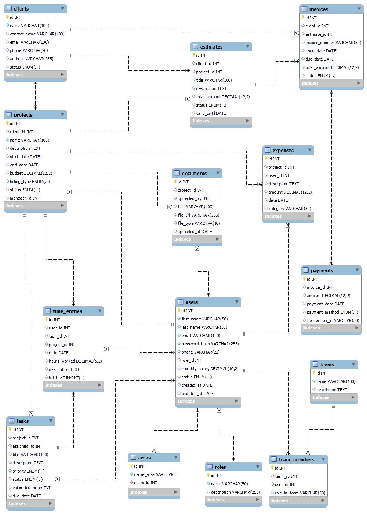

---
## 4. Cómo ejecutar este proyecto

Este proyecto es una aplicación en **Node.js** y **Express**. Para ejecutarlo localmente, sigue estos pasos:

### 4.1. Clonar el repositorio:

```bash
git clone https://github.com/tu_usuario/primer_entrega_crud.git
cd primer_entrega_crud
````

### 4.2. Instalar las dependencias:

```bash
npm install
```

Esto instalará todas las dependencias necesarias que están listadas en `package.json`.

### 4.3. Ejecutar la aplicación:

* Para desarrollo (se reinicia automáticamente al modificar archivos):

```bash
npm run dev
```

* Para producción:

```bash
npm start
```

### 4.4 Abrir la aplicación en el navegador:

El servidor se ejecutará en el puerto definido en tu archivo `.env`.  
Si no has definido un puerto, por defecto será `http://localhost:3000`.


### 4.5 Variables de entorno

Este proyecto utiliza variables de entorno para configurar ciertos parámetros (por ejemplo, puerto del servidor, credenciales, etc.).  

1. Crea un archivo llamado `.env` en la raíz del proyecto.
2. Agrega tus variables de entorno siguiendo este formato:

```

PORT=3000
DB\_USER=usuario
DB\_PASS=contraseña
OTRA\_VARIABLE=valor

```

3. Guarda el archivo. Ahora la aplicación podrá acceder a estas variables mediante `process.env` en Node.js.

### 5. Capturas de Consultas

Se incluyen capturas de pantalla de las peticiones realizadas con la herramienta Postman en Visual Studio Code, a la API RESTful para demostrar su funcionamiento y validar las operaciones CRUD.

Postman permite enviar solicitudes HTTP (`GET`, `POST`, `PUT`, `PATCH`, `DELETE`) y visualizar respuestas en formato JSON. En este caso, se documenta la gestión de clientes.

-----

### 5.1 Ejecución del Servidor

Antes de realizar cualquier consulta, se ejecuta el servidor de la API para que esté disponible para recibir solicitudes.

Comando ejecutado:

```bash
npm run dev
```

Resultado esperado:

```
Mensaje en consola indicando que el servidor está corriendo, por ejemplo:
Servidor de ClickWave corriendo en http://localhost:4000
```


-----

### 5.2 Ejemplo de Consulta - CRUD: Cliente

#### 1\. Crear un cliente (`POST /api/clients`)

Solicitud enviada:

  - **URL**: `http://localhost:4000/api/clients`
  - **Método**: `POST`
  - **Cuerpo (JSON)**:

<!-- end list -->

```json
{
   "name": "MardelTech",
   "contact_name": "Luis Pérez",
   "email": "luis@mardeltech.com",
   "phone": "+54 223 123 4567",
   "address": "Mar del Plata, Argentina",
   "status": "active"
}
```

Respuesta recibida:

  - **Código HTTP**: `201`
  - **Cuerpo JSON**:

<!-- end list -->

```json
{
   "id": "7",
   "name": "MardelTech",
   "contact_name": "Luis Pérez",
   "email": "luis@mardeltech.com",
   "phone": "+54 223 123 4567",
   "address": "Mar del Plata, Argentina",
   "status": "active"
}
```

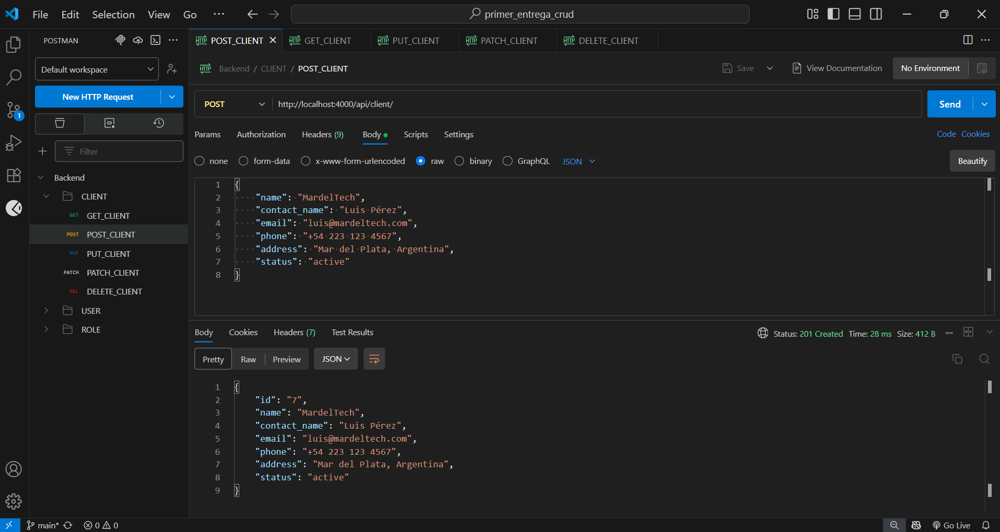

-----

#### 2\. Obtener todos los clientes (`GET /api/clients`)

Solicitud enviada:

  - **URL**: `http://localhost:4000/api/clients`
  - **Método**: `GET`
  - **Cuerpo de la solicitud**: No aplica (`GET` no envía cuerpo)

Respuesta recibida:

  - **Código HTTP**: `200`
  - **Cuerpo JSON**:

<!-- end list -->

```json
[
   {
      "id": "1",
      "name": "TechCorp",
      "contact_name": "Laura Pérez",
      "email": "laura@techcorp.com",
      "phone": "+34 91 123 4567",
      "address": "Madrid, España",
      "status": "active"
   },
   {
      "id": "2",
      "name": "InnovaSoft",
      "contact_name": "José Ramírez",
      "email": "jose@innovasoft.com",
      "phone": "+52 55 9988 7766",
      "address": "CDMX, México",
      "status": "active"
   },
   {
      "id": "3",
      "name": "HealthPlus",
      "contact_name": "Andrea Torres",
      "email": "andrea@healthplus.com",
      "phone": "+54 11 6677 8899",
      "address": "Buenos Aires, Argentina",
      "status": "inactive"
   },
   {
      "id": "4",
      "name": "EduPro",
      "contact_name": "Sofía Morales",
      "email": "sofia@edupro.com",
      "phone": "+1 202 555 0147",
      "address": "Miami, USA",
      "status": "active"
   },
   {
      "id": "5",
      "name": "GreenEnergy",
      "contact_name": "Pablo Vega",
      "email": "pablo@greenenergy.com",
      "phone": "+49 30 1122 3344",
      "address": "Berlín, Alemania",
      "status": "active"
   },
   {
      "id": "6",
      "name": "IngeMar",
      "contact_name": "Martina Gonzales",
      "email": "martinagonzales@ingemar.com",
      "phone": "+54 9 223 636 588",
      "address": "Mar del Plata, Argentina",
      "status": "active"
   },
   {
      "id": "7",
      "name": "MardelTech",
      "contact_name": "Luis Pérez",
      "email": "luis@mardeltech.com",
      "phone": "+54 223 123 4567",
      "address": "Mar del Plata, Argentina",
      "status": "active"
   }
]
```
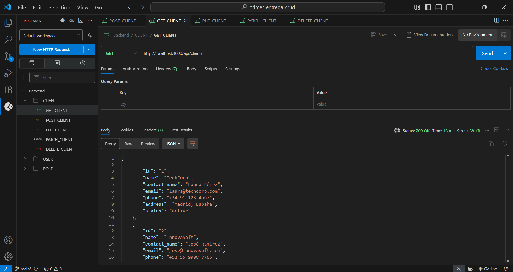
-----

#### 3\. Obtener un cliente por ID (`GET /api/clients/:id`)

Solicitud enviada:

  - **URL**: `http://localhost:4000/api/clients/7`
  - **Método**: `GET`
  - **Cuerpo de la solicitud**: No aplica (`GET` no envía cuerpo)

Respuesta recibida:

  - **Código HTTP**: `200`
  - **Cuerpo JSON**:

<!-- end list -->

```json
{
   "id": "7",
   "name": "MardelTech",
   "contact_name": "Luis Pérez",
   "email": "luis@mardeltech.com",
   "phone": "+54 223 123 4567",
   "address": "Mar del Plata, Argentina",
   "status": "active"
}
```

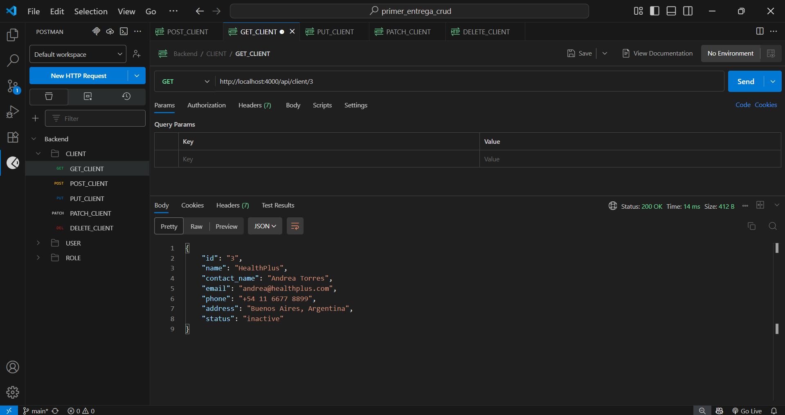

-----

#### 4\. Actualizar datos de un cliente por ID (`PUT /api/clients/:id`)

Solicitud enviada:

  - **URL**: `http://localhost:4000/api/clients/7`
  - **Método**: `PUT`
  - **Cuerpo (JSON)**:

<!-- end list -->

```json
{
   "name": "MardelTech",
   "contact_name": "Luis Garcia",
   "email": "luisgarcia@mardeltech.com",
   "phone": "+54 223 123 4567",
   "address": "Mar del Plata, Argentina",
   "status": "inactive"
}
```

Respuesta recibida:

  - **Código HTTP**: `200`
  - **Cuerpo JSON**:

<!-- end list -->

```json
{
   "id": "7",
   "name": "MardelTech",
   "contact_name": "Luis Garcia",
   "email": "luisgarcia@mardeltech.com",
   "phone": "+54 223 123 4567",
   "address": "Mar del Plata, Argentina",
   "status": "inactive"
}
```
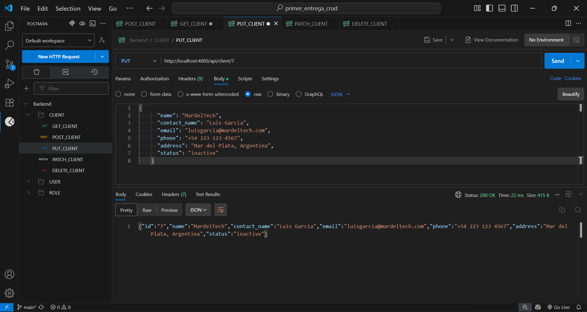
-----

#### 5\. Actualizar campos específicos de un cliente (`PATCH /api/clients/:id`)

Solicitud enviada:

  - **URL**: `http://localhost:4000/api/clients/7`
  - **Método**: `PATCH`
  - **Cuerpo (JSON)**:

<!-- end list -->

```json
{
   "phone":"+54 223 333 5899",
   "status": "active"
}
```

Respuesta recibida:

  - **Código HTTP**: `200`
  - **Cuerpo JSON**:

<!-- end list -->

```json
{
   "id": "7",
   "name": "MardelTech",
   "contact_name": "Luis Garcia",
   "email": "luisgarcia@mardeltech.com",
   "phone": "+54 223 333 5899",
   "address": "Mar del Plata, Argentina",
   "status": "active"
}
```
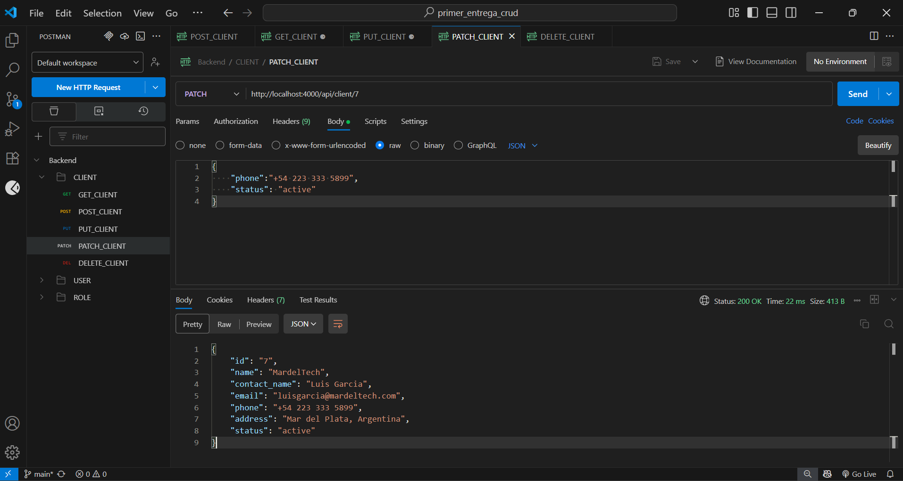

-----

#### 6\. Eliminar un cliente por ID (`DELETE /api/clients/:id`)

Solicitud enviada:

  - **URL**: `http://localhost:4000/api/clients/1`
  - **Método**: `DELETE`
  - **Cuerpo de la solicitud**: No aplica (`DELETE` no envía cuerpo)

Respuesta recibida:

  - **Código HTTP**: `204` (No Content)

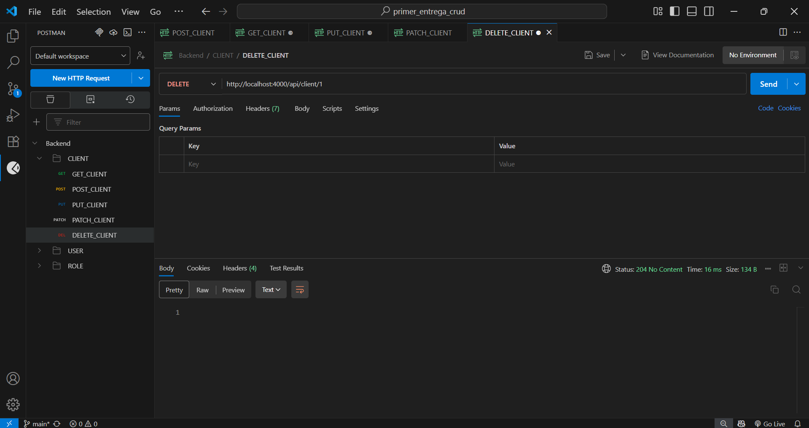

---

### 5.3 Ejemplo de Consulta - CRUD: Project

#### 1\. Crear un proyecto (`POST /api/projects`)

Solicitud enviada:

  - **URL**: `http://localhost:4000/api/projects`
  - **Método**: `POST`
  - **Cuerpo (JSON)**:

```json
{
   "client_id": 105,
   "name": "Campaña Publicitaria Primavera 2025",
   "description": "Campaña integral de marketing para productos de primavera.",
   "start_date": "2025-04-01",
   "end_date": "2025-06-30",
   "budget": 18000,
   "billing_type": "fixed",
   "status": "planned",
   "manager_id": 205
}
```

Respuesta recibida:

  - **Código HTTP**: `201`
  - **Cuerpo JSON**:

<!-- end list -->

```json
{
   "id": "6",
   "client_id": 105,
   "name": "Campaña Publicitaria Primavera 2025",
   "description": "Campaña integral de marketing para productos de primavera.",
   "start_date": "2025-04-01",
   "end_date": "2025-06-30",
   "budget": 18000,
   "billing_type": "fixed",
   "status": "planned",
   "manager_id": 205
}
```

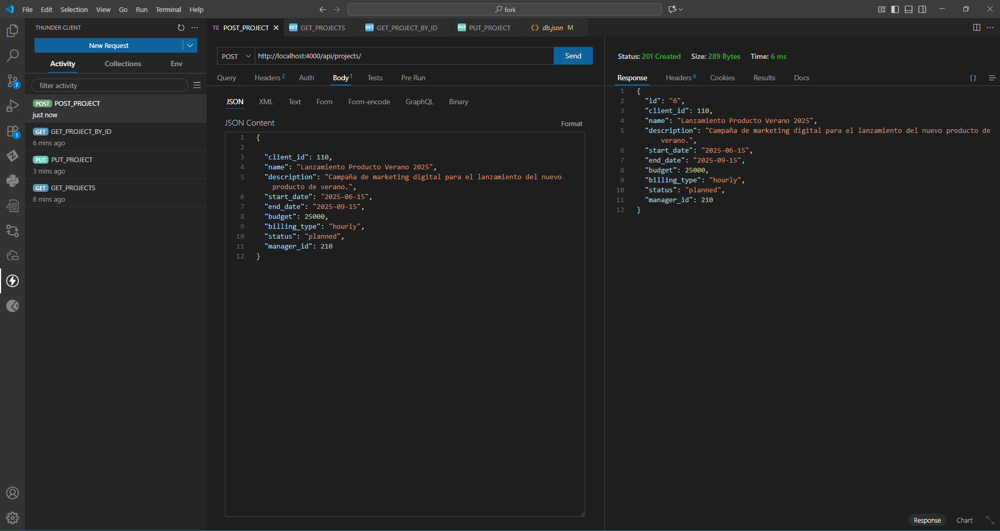

-----
#### 2\. Obtener todos los proyectos (`GET /api/projects`)

**Solicitud enviada:**

- **URL**: `http://localhost:4000/api/projects`
- **Método**: `GET`
- **Cuerpo de la solicitud**: No aplica (`GET` no envía cuerpo)

**Respuesta recibida:**

- **Código HTTP**: `200`
- **Cuerpo JSON**:

<!-- end list -->

```json
[
    {
    "id": 1,
    "client_id": 1,
    "name": "Plataforma de Gestión",
    "description": "Sistema integral para TechCorp",
    "start_date": "2025-02-01",
    "end_date": "2025-06-30",
    "budget": 50000,
    "billing_type": "fixed",
    "status": "in_progress",
    "manager_id": 2
  },
  {
    "id": 2,
    "client_id": 2,
    "name": "App Móvil de Ventas",
    "description": "Aplicación de ventas para InnovaSoft",
    "start_date": "2025-01-15",
    "end_date": "2025-04-15",
    "budget": 30000,
    "billing_type": "hourly",
    "status": "in_progress",
    "manager_id": 4
  },
  {
    "id": 3,
    "client_id": 3,
    "name": "Portal de Salud",
    "description": "Portal de pacientes para HealthPlus",
    "start_date": "2025-03-01",
    "end_date": "2025-07-30",
    "budget": 45000,
    "billing_type": "fixed",
    "status": "planned",
    "manager_id": 2
  },
  {
    "id": 4,
    "client_id": 4,
    "name": "E-learning Platform",
    "description": "Plataforma de cursos en línea",
    "start_date": "2025-02-20",
    "end_date": "2025-08-20",
    "budget": 60000,
    "billing_type": "fixed",
    "status": "in_progress",
    "manager_id": 1
  },
  {
    "id": "5",
    "client_id": 105,
    "name": "Campaña Publicitaria Primavera 2025",
    "description": "Campaña integral de marketing para productos de primavera.",
    "start_date": "2025-04-01",
    "end_date": "2025-06-30",
    "budget": 18000,
    "billing_type": "fixed",
    "status": "planned",
    "manager_id": 205
  }
   {
      "id": "6",
      "client_id": 105,
      "name": "Campaña Publicitaria Primavera 2025",
      "description": "Campaña integral de marketing para productos de primavera.",
      "start_date": "2025-04-01",
      "end_date": "2025-06-30",
      "budget": 18000,
      "billing_type": "fixed",
      "status": "planned",
      "manager_id": 205
   }
]

```
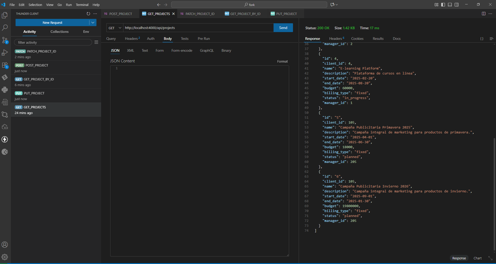
-----

#### 3\. Obtener un proyecto por ID (`GET /api/projects/:id`)

**Solicitud enviada:**

- **URL**: `http://localhost:4000/api/projects/6`
- **Método**: `GET`
- **Cuerpo de la solicitud**: No aplica (`GET` no envía cuerpo)

**Respuesta recibida:**

- **Código HTTP**: `200`
- **Cuerpo JSON**:

<!-- end list -->

```json
{
   "id": "6",
   "client_id": 105,
   "name": "Campaña Publicitaria Primavera 2025",
   "description": "Campaña integral de marketing para productos de primavera.",
   "start_date": "2025-04-01",
   "end_date": "2025-06-30",
   "budget": 18000,
   "billing_type": "fixed",
   "status": "planned",
   "manager_id": 205
}

```
### 4. Actualizar un proyecto por ID (PUT /api/projects/:id)

**Solicitud enviada:**

- **URL:** `http://localhost:4000/api/projects/6`  
- **Método:** `PUT`  
- **Cuerpo (JSON):**

```json
{ 
    "client_id": 105,
    "name": "Campaña Publicitaria Invierno 2026",
    "description": "Campaña integral de marketing para productos de invierno.",
    "start_date": "2025-09-01",
    "end_date": "2025-01-30",
    "budget": 19800000,
    "billing_type": "fixed",
    "status": "planned",
    "manager_id": 205
  }

```
**Respuesta recibida:**

- **Código HTTP**: `200`
- **Cuerpo JSON**:

<!-- end list -->

```json
{
  "id": "6",
  "client_id": 105,
  "name": "Campaña Publicitaria Invierno 2026",
  "description": "Campaña integral de marketing para productos de invierno.",
  "start_date": "2025-09-01",
  "end_date": "2025-01-30",
  "budget": 19800000,
  "billing_type": "fixed",
  "status": "planned",
  "manager_id": 205
}

```

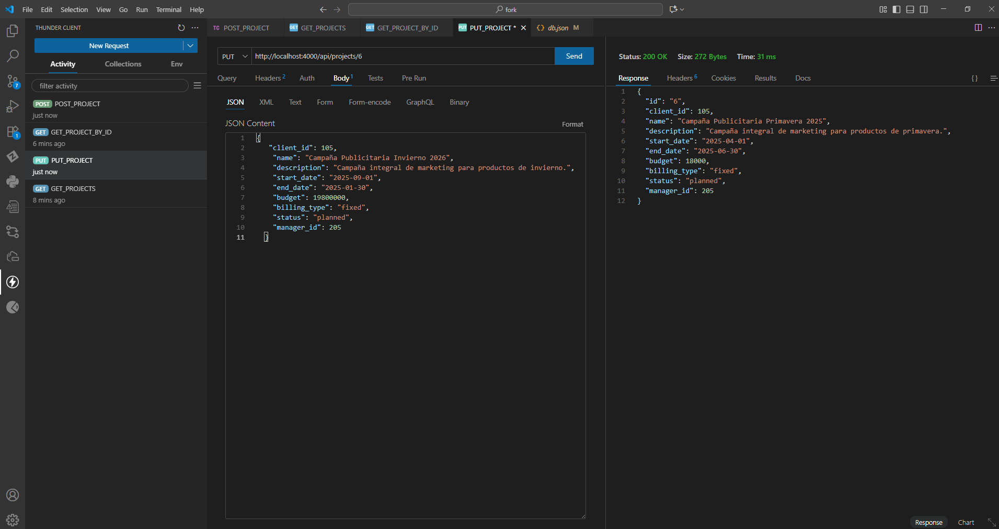
-----

## 5. Actualizar campos específicos de un proyecto (PATCH /api/projects/:id)

**Solicitud enviada:**

- **URL:** `http://localhost:4000/api/projects/6`  
- **Método:** `PATCH`  
- **Cuerpo (JSON):**

<!-- end list -->

```json
{
  "budget": 85600000,
  "billing_type": "hourly"
}     
```
**Respuesta recibida:**

- **Código HTTP**: `200`
- **Cuerpo JSON**:

<!-- end list -->

```json
{
  "id": "6",
  "client_id": 105,
  "name": "Campaña Publicitaria Invierno 2026",
  "description": "Campaña integral de marketing para productos de invierno.",
  "start_date": "2025-09-01",
  "end_date": "2025-01-30",
  "budget": 85600000,
  "billing_type": "hourly",
  "status": "planned",
  "manager_id": 205
}
```
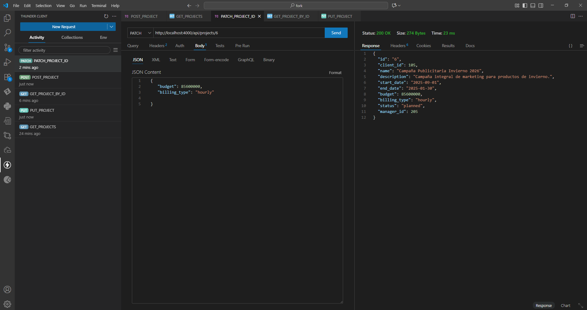

-----

## 6. Eliminar un proyecto por ID (DELETE /api/projects/:id)

**Solicitud enviada:**

- **URL:** `http://localhost:4000/api/projects/6`  
- **Método:** `DELETE`  
- **Cuerpo de la solicitud:** No aplica (DELETE no envía cuerpo)  

**Respuesta recibida:**

- **Código HTTP:** `204 (No Content)`  

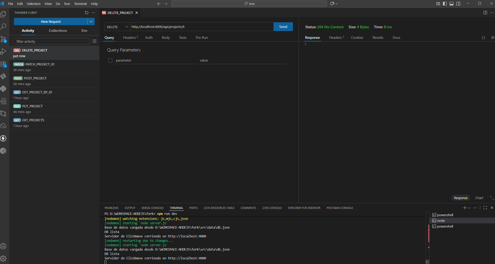

---

## 6. Capturas de Views

En esta sección se presentan capturas de pantalla de las views desarrolladas utilizando Pug como motor de plantillas y Bootstrap para el diseño y la maquetación.

### Página principal

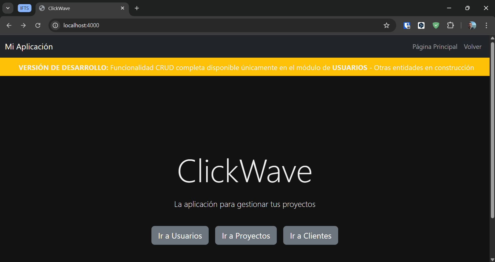

### Página Usuarios del sistema

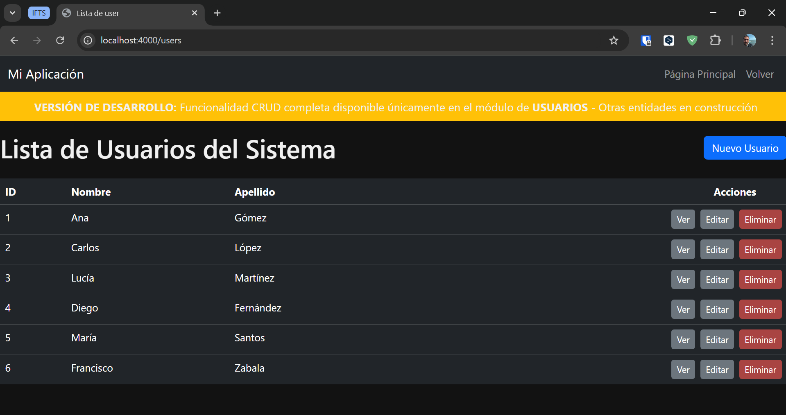

### Eliminar a un usuario

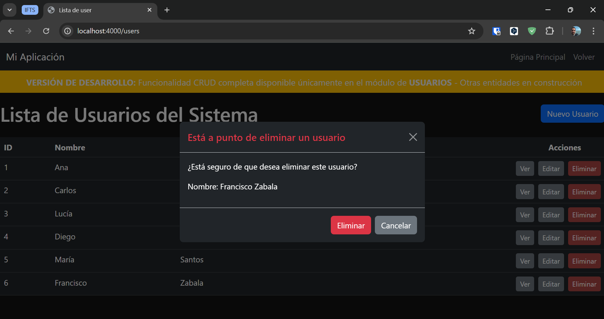

### Crear un nuevo usuario

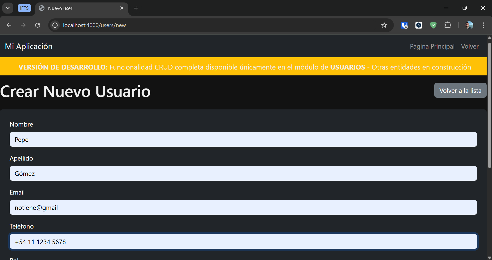

### Editar un los datos de un usuario

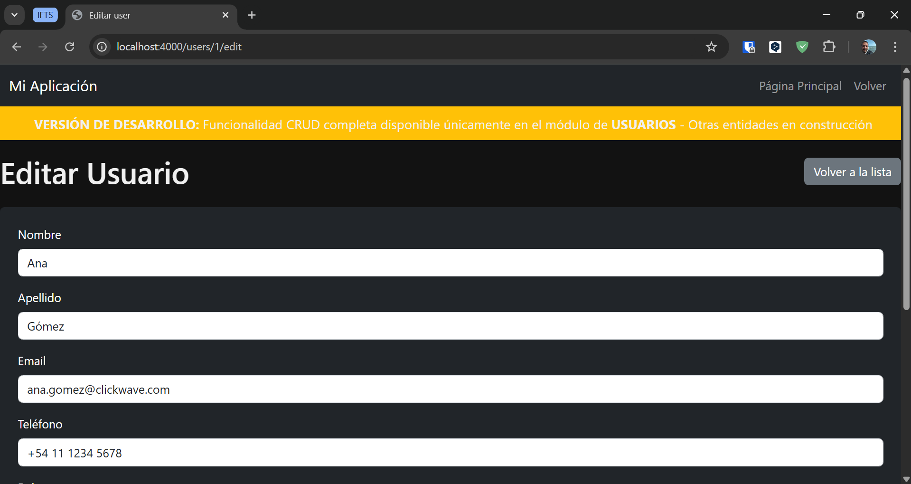


## 7. Uso de IAs

### 7.1 Modelos  

Durante el desarrollo de este proyecto se emplearon herramientas de Inteligencia Artificial (IA) para mejorar la eficiencia en la codificación, la comprensión teórica y la elaboración de documentación. Específicamente, se utilizó el modelo **ChatGPT (GPT-5 mini, proporcionado por OpenAI)** en su versión en la nube, así como el modelo **Claude AI (Claude Opus 4.1, proporcionado por Anthropic)** en su versión en la nube.  

El uso de la IA incluyó las siguientes funciones principales:  
- **Corrección de código:** revisión de sintaxis, detección de errores lógicos y sugerencias de optimización en JavaScript, incluyendo Node.js, Express.js y dependencias como dotenv y nodemon.  
- **Explicaciones teóricas:** consultas sobre funcionamiento de conceptos de programación, arquitectura de software y metodologías de desarrollo.  
- **Generación de documentación:** asistencia en la redacción de secciones formales del proyecto, incluyendo guías, introducciones, análisis de caso.  

---

### 7.2 Prompts  

**AI:** ChatGPT
**Modelo:** GPT-5 Mini  
**Prompt:**  
Genera un JSON de ejemplo para un sistema de gestión de proyectos que incluya datos realistas para cada entidad. Las entidades son:
1. users: id(string), nombre, apellido, email, hash de contraseña, teléfono, role_id, salario mensual, estado, fecha de creación y actualización.
2. roles: id(string), nombre, descripción.
2. areas: id(string), name_area.
3. clients: id(string), nombre, persona de contacto, email, teléfono, dirección, estado.
4. projects: id(string), client_id, nombre, descripción, fecha de inicio y fin, presupuesto, tipo de facturación, estado, manager_id.
5. tasks: id(string), project_id, assigned_to (user_id), título, descripción, prioridad, estado, horas estimadas, fecha de entrega.
6. time_entries: id(string), user_id, task_id, project_id, fecha, horas trabajadas, descripción, facturable.
7. estimates: id(string), client_id, project_id, título, descripción, monto total, estado, fecha de validez.
8. invoices: id(string), client_id, estimate_id, número de factura, fecha de emisión, fecha de vencimiento, monto total, estado.
9. payments: id(string), invoice_id, monto, fecha de pago, método de pago, id de transacción.
10. expenses: id(string), project_id, user_id, descripción, monto, fecha, categoría.
11. teams: id(string), nombre, descripción.
12. team_members: id(string), team_id, user_id, rol dentro del equipo.
13. documents: id(string), project_id, uploaded_by (user_id), título, url del archivo, tipo de archivo, fecha de subida.

Asegúrate de:
- Usar nombres, emails y direcciones realistas.
- Incluir al menos 5-6 registros por entidad.
- Generar relaciones coherentes entre entidades (`foreign keys`).
- Diferenciar estados (`active`, `inactive`, `pending`, `in_progress`, etc.).
- Usar fechas consistentes en el año 2025.

**Respuesta:**  

[Link al archivo db.json](https://github.com/eduardo-mendiola/backend-ifts29/blob/main/src/data/db.json)

**AI y Modelo:**  
**Prompt:**  
**Respuesta:**  


---

## 8. Bibliografía y Fuentes

- IFTS Nro. 29, Tecnicatura Superior en Desarrollo de Software a Distancia, Desarrollo de Sistemas Web (Back End) - 2° (2025). [Enlace](https://aulasvirtuales.bue.edu.ar/course/view.php?id=22553)  
- The Net Ninja. MERN Stack Crash Course Tutorial [Playlist]. YouTube. 2022. [Enlace](https://youtube.com/playlist?list=PL4cUxeGkcC9iJ_KkrkBZWZRHVwnzLIoUE&si=TEi7PZTW6xPRlSSk)  
- Martín Gesualdo. Emprendedor Full Stack | Aprende a desarrollar aplicaciones web [Playlist]. YouTube. 2023. [Enlace](https://youtube.com/playlist?list=PLAmcNbGd0fkNl-CleT_XxwGKDk1j00uUp&si=U8oSAdMzI47pPvVo)  
- Node.js Foundation. Node.js. Recuperado en septiembre de 2025. [Enlace](https://node.js.org/)  
- npm, Inc. Documentación de npm. Recuperado en septiembre de 2025. [Enlace](https://docs.npmjs.com/)  
- Express.js. Documentación oficial de Express.js. Recuperado en septiembre de 2025. [Enlace](https://expressjs.com/)
- Pug Documentación oficial de plantillas Pug. Recuperado en septiembre de 2025. [Enlace]https://pugjs.org/api/getting-started.html
- Bootstrap Documentación oficial de Bootstrap v5.3. Recuperado en septiembre de 2025. [Enlace]https://getbootstrap.com/docs/5.3/getting-started/introduction/
